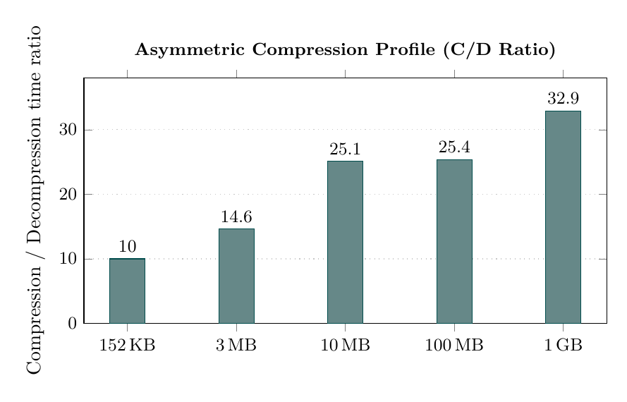
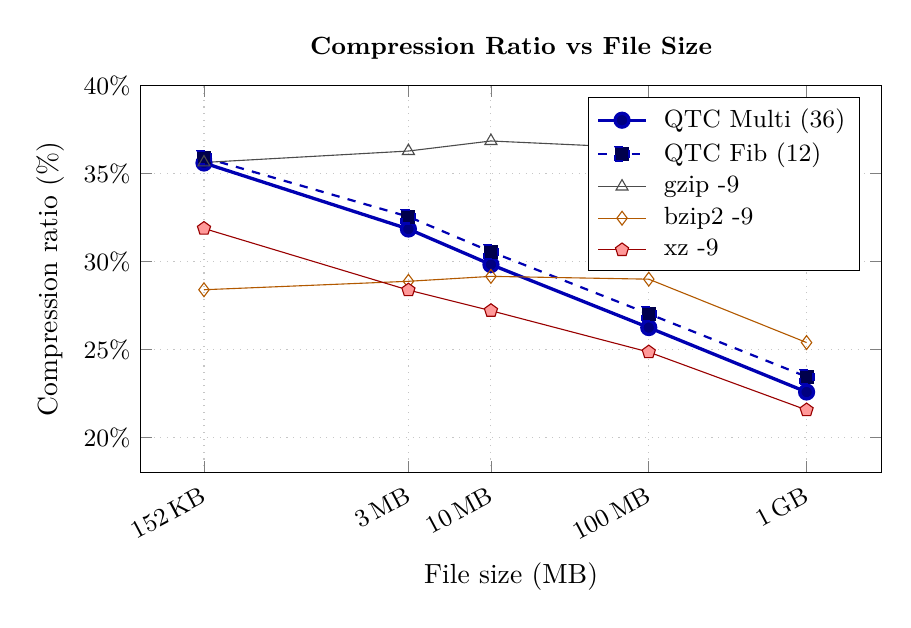
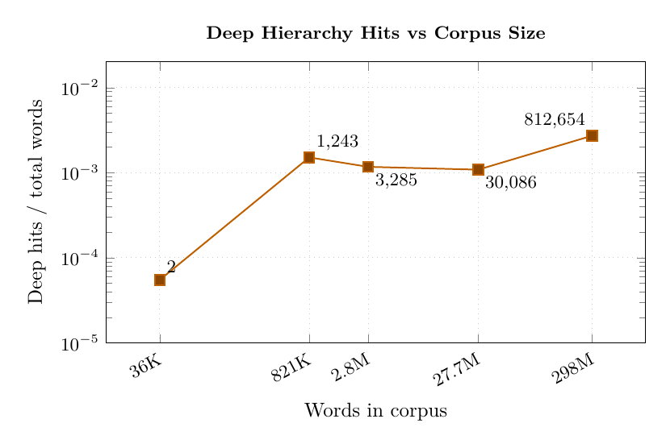
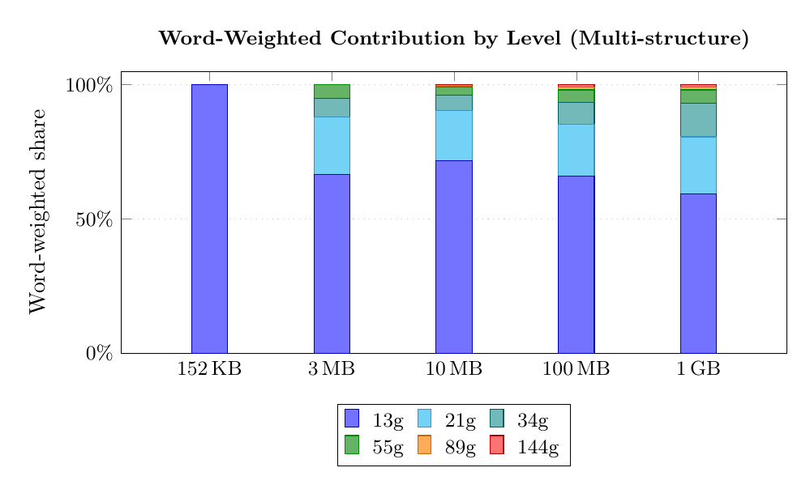
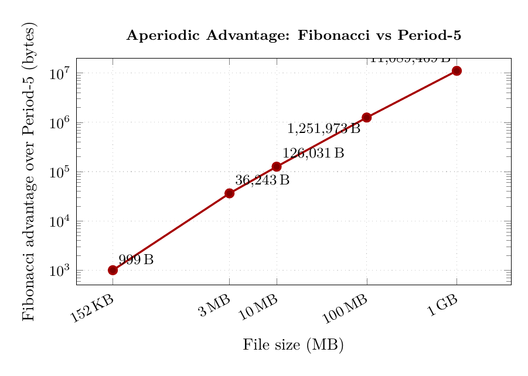

**Aperiodic Structures Never Collapse: Fibonacci Hierarchies for Lossless Compression**

**Quasicryth** *(quasicrystalline tiling hierarchy)* is a lossless text compressor built on a one-dimensional Fibonacci quasicrystal tiling. It achieves competitive compression ratios on natural language text by exploiting a deep multi-scale phrase hierarchy — phrases of 2, 3, 5, 8, 13, 21, 34, 55, 89, and 144 words — whose structure is entirely determined by a single 2-byte parameter in the file header.

---

## How It Works

Quasicryth operates entirely at the **word level**. The core idea is that a Fibonacci quasicrystal tiling assigns each word position one of two tile types — **L** (long, bigram) or **S** (short, unigram) — and this tiling has a recursive self-similar structure that naturally provides phrase-level lookup positions at all Fibonacci lengths simultaneously.

### 1. Tokenisation and case separation

The input is split into word tokens. Capitalisation (lower / title / upper) is stripped and encoded separately as a 3-symbol stream with arithmetic coding. The rest of the pipeline works on lowercased tokens.

### 2. Codebook construction

Eleven frequency-ranked codebooks are built from the word sequence:

| Codebook | Phrase length | Max entries |
|---|---|---|
| Unigram | 1 word | 8,000 |
| Bigram | 2 words | 6,000 |
| Trigram | 3 words | 2,000 |
| 5-gram | 5 words | 2,000 |
| 8-gram | 8 words | 1,000 |
| 13-gram | 13 words | 1,000 |
| 21-gram | 21 words | 500 |
| 34-gram | 34 words | 500 |
| 55-gram | 55 words | 200 |
| 89-gram | 89 words | 200 |
| 144-gram | 144 words | 100 |

The phrase lengths {1, 2, 3, 5, 8, 13, 21, 34, 55, 89, 144} are consecutive Fibonacci numbers. This is not coincidental — see [Tiling](#3-fibonacci-quasicrystal-tiling) below.

### 3. Fibonacci quasicrystal tiling

The compressor generates a Fibonacci quasicrystal sequence using the **cut-and-project** method. For each word position *k*:

```
tile(k) = L  if  floor((k+1+θ)/φ) - floor((k+θ)/φ) = 1
tile(k) = S  otherwise
```

where *φ = (1+√5)/2* is the golden ratio and *θ* is a phase parameter.

- An **L tile** at position *k* means: attempt a **bigram** lookup at words *[k, k+1]*
- An **S tile** means: attempt a **unigram** lookup at word *k*

The compressor evaluates **32 candidate phases** and selects the one that maximises a scoring function which exponentially rewards deeper hierarchy hits:
unigram +3, bigram +10, trigram +20, 5-gram +50, 8-gram +100, 13-gram +200, ..., 144-gram +6400.

### 4. Deep substitution hierarchy

The tiling is more than a flat L/S sequence. Applying the inverse Fibonacci substitution rule — merging each (L, S) pair into a super-L, each isolated L into a super-S — builds a 10-level hierarchy:

```
Level 0:  L S L L S ...        (bigrams and unigrams)
Level 1:  [L S] → super-L      (trigrams,  3 words)
Level 2:  super²-L             (5-grams,   5 words)
Level 3:  super³-L             (8-grams,   8 words)
Level 4:  super⁴-L             (13-grams, 13 words)
  ...
Level 9:  super⁹-L             (144-grams,144 words)
```

At each L tile position, the encoder tries the **deepest applicable hierarchy level first**, falling back down until a codebook hit is found or falling through to a raw unigram escape. A 144-gram hit encodes 144 words as a single arithmetic coding symbol.

### 5. Arithmetic coding

Each tile is encoded with a 256-symbol adaptive arithmetic coder. The tile's position within the hierarchy provides **3 bits of free context** (8 sub-models per tile type), derived deterministically from the tiling — no extra bits needed.

### 6. Out-of-vocabulary escape stream

Words not in any codebook are collected into a separate buffer and compressed with **bzip2** (~2.6 bits/byte vs ~3.5 bits/byte for inline AC encoding). The quasicrystal tiling determines which words escape; the decoder pulls from this buffer in the same order.

### 7. Output format

```
[magic 4B][orig size 4B][phase 2B][flags 1B][counts...][payload][case][codebook(zlib)][escapes(bz2)][MD5 16B]
```

The **2-byte phase** is the only structural information in the header. Everything else — all tile boundaries, hierarchy levels, deep n-gram positions, and model assignments — is regenerated deterministically by the decoder.

---

## Asymmetric Compression

Quasicryth is an **asymmetric compressor**: compression is slow, decompression is fast.

| File | Compress | Decompress | C/D ratio |
|---|---|---|---|
| alice29.txt (152 KB) | 0.1s | <0.1s | ~5× |
| enwik8\_3M (3 MB) | 1.9s | 0.3s | 6.3× |
| enwik8\_10M (10 MB) | 11.5s | 1.0s | 11.5× |
| enwik8 (100 MB) | 142.0s | 10.0s | 14.2× |
| enwik9 (1 GB) | 1,539.7s | 97.0s | **15.9×** |

Decompression throughput: **~10 MB/s**. The ratio grows with file size because 89-gram and 144-gram frequency counting dominates codebook construction at scale. Decompression is always a single sequential pass with no search.



*Well-suited for write-once, read-many scenarios: archival, content distribution, static assets.*

---

## Build

```bash
cd qtc_c
make
# produces: ./qtc
# requires: gcc, zlib (-lz), bzip2 (-lbz2)
```

## Usage

```bash
# Compress
./qtc -c input.txt output.qtc

# Decompress
./qtc -d output.qtc restored.txt
```

---

## Results

Tested on the [Large Text Compression Benchmark](http://mattmahoney.net/dc/text.html) corpora.

| File | Size | Quasicryth | gzip -9 | bzip2 -9 | xz -9 |
|---|---|---|---|---|---|
| alice29.txt | 152 KB | **36.92%** | 35.63% | 28.41% | 31.89% |
| enwik8\_3M | 3 MB | **39.29%** | 36.29% | 28.89% | 28.39% |
| enwik8\_10M | 10 MB | **38.51%** | 36.85% | 29.16% | 27.21% |
| enwik8 | 100 MB | **37.70%** | 36.45% | 29.01% | 24.87% |
| enwik9 | 1 GB | **35.99%** | 32.26% | 25.40% | 21.57% |

*Ratio = compressed size / original size × 100%. Lower is better.*

### Compressed file breakdown (enwik9, 1 GB)

| Stream | Size | Notes |
|---|---|---|
| Payload (AC) | 254,952,735 B | Codebook indices + escape flags |
| Escape words (bz2) | 83,537,358 B | Out-of-vocabulary words |
| Codebook (zlib) | 77,585 B | All 11 codebook levels |
| Case data (AC) | 21,315,698 B | Uppercase/titlecase flags |
| **Total** | **359,883,431 B** | **35.99%** |

---

## Charts

### QC Tiling Contribution
Payload savings from the quasicrystal tiling alone over an all-unigram baseline (same codebooks, same escape stream). At 1 GB the tiling saves **45,608,715 B (4.56%)**.



### Deep Hierarchy Hits vs Corpus Size
Labels show absolute deep hit counts. At enwik9 scale (298M words), **812,654 deep hits** across levels 13g–144g.



### Word-Weighted Contribution by Level
Each hit weighted by phrase length (*hits × n*). The 144-gram contributes 1.1% of covered words at 1 GB despite only 945 hits — each hit encodes 144 words.



### Aperiodic Advantage: Fibonacci vs Period-5
Controlled A/B test with identical codebooks. Period-5 (LLSLS, the closest periodic approximant) collapses at level 4 — zero 13-gram through 144-gram positions. Fibonacci never collapses.

| File | Fibonacci payload | Period-5 payload | Fibonacci advantage |
|---|---|---|---|
| enwik8\_3M | 801,260 B | 802,632 B | **+1,372 B** |
| enwik8\_10M | 2,654,135 B | 2,659,942 B | **+5,807 B** |
| enwik8 | 26,196,712 B | 26,237,097 B | **+40,385 B** |
| enwik9 | 254,952,735 B | 256,302,106 B | **+1,349,371 B** |



The 33× jump from 100 MB to 1 GB (for a 10× size increase) is explained by the 89-gram and 144-gram levels activating at enwik9 scale, adding new compression terms absent at smaller scales.

---

## Deep Hierarchy Hits

All levels 13g–144g are positions **structurally unavailable to any periodic tiling**.

| File | Words | 13g | 21g | 34g | 55g | 89g | 144g | Total |
|---|---|---|---|---|---|---|---|---|
| alice29.txt | 36K | 2 | — | — | — | — | — | **2** |
| enwik8\_3M | 821K | 971 | 195 | 77 | — | — | — | **1,243** |
| enwik8\_10M | 2.8M | 2,715 | 383 | 140 | 47 | — | — | **3,285** |
| enwik8 | 27.7M | 24,910 | 3,256 | 1,369 | 551 | — | — | **30,086** |
| enwik9 | 298.3M | 652,124 | 109,492 | 40,475 | 7,222 | 2,396 | 945 | **812,654** |

---

## Theoretical Background

The paper proves an **Aperiodic Hierarchy Advantage** for Fibonacci quasicrystal tilings — a master result with seven supporting theorems.

### Main theorem: Aperiodic Hierarchy Advantage

The Fibonacci tiling is the only infinite binary tiling satisfying all five of the following simultaneously:

1. **Non-collapse at every depth** — non-zero *n*-gram lookup positions exist at every hierarchy level. Every periodic tiling collapses after *O(log p)* levels for period *p* (proved via the Pisot-Vijayaraghavan property of *φ*).
2. **Scale-invariant coverage** — potential word coverage *C(m) = P(m)·F_m → Wφ/√5* at every level.
3. **Maximal codebook efficiency** — coverage efficiency *η_m = C_m/(F_m+1)* is maximal among aperiodic tilings.
4. **Bounded parsing overhead** — total per-word flag entropy *h_flags ≤ 1/φ ≈ 0.618* bits/word regardless of depth; net efficiency *ν(W) → +∞* as *W* grows.
5. **Strict coding entropy advantage** — for long-range-dependent sources, *H^fib(P) < H^per(P)* strictly.

### Supporting theorems

**Fibonacci Stability / Periodic Collapse** — The Fibonacci hierarchy never collapses; every periodic tiling collapses after *O(log p)* levels. All hierarchy levels 13g–144g are positions structurally unavailable to any periodic tiling.

**Golden Compensation** — At every level *m*, the exponential decay in position count *P(m) ~ φ^{-m}* is cancelled exactly by the exponential growth in phrase length *F_m ~ φ^m/√5*, so coverage converges to the same constant *Wφ/√5 ≈ 0.724W* at every depth. Proved via Binet's formula and *φ² = φ+1*.

**Sturmian Codebook Efficiency** — Using the Sturmian complexity law *p(n) = n+1* (Morse-Hedlund theorem), the Fibonacci hierarchy achieves the maximum possible codebook coverage efficiency *η_m = C_m/(F_m+1)* among all binary aperiodic tilings, since no aperiodic sequence can have fewer than *F_m+1* distinct length-*F_m* factors.

**Goldilocks corollary** — Fibonacci is the only binary aperiodic sequence achieving both non-collapse and maximal Sturmian efficiency simultaneously.

**Activation Threshold** — Level *m* first contributes compression when *W ≥ W\*_m = T_m · φ^{m-1} / r_m*, giving a closed-form prediction for when each deep level activates.

**Piecewise-Linear Advantage** — The aperiodic advantage over any periodic tiling is a convex piecewise-linear function of corpus size, with slope increasing discretely at each activation threshold. The 33× jump from 100 MB to 1 GB is a discrete phase transition caused by the 89-gram and 144-gram levels activating, not superlinear growth of existing terms.

**Fibonacci Redundancy Bound** — For exponentially mixing sources, coding redundancy at level *m* decays super-exponentially: *R_m^fib(P) = O(e^{-φ^m/(λ√5)})*, since *F_m ~ φ^m/√5* grows exponentially in *m*. Periodic systems remain locked at the depth where collapse occurs.

**Exponential Dictionary Efficiency** — Per-entry gain *E_m = F_m·h̄ - log₂C_m = Ω(φ^m)*. Total dictionary value *V(k_max) = Ω(φ^{k_max})*, growing exponentially with hierarchy depth and exceeding any periodic hierarchy's *O(φ^{m\*})* bound.

Full proofs (Perron-Frobenius, Pisot-Vijayaraghavan, Sturmian sequences, Weyl's equidistribution) in [`quasicryth_paper.pdf`](quasicryth_paper.pdf).

---

**Author:** Roberto Tacconelli (tacconelli.rob@gmail.com), Independent Researcher
